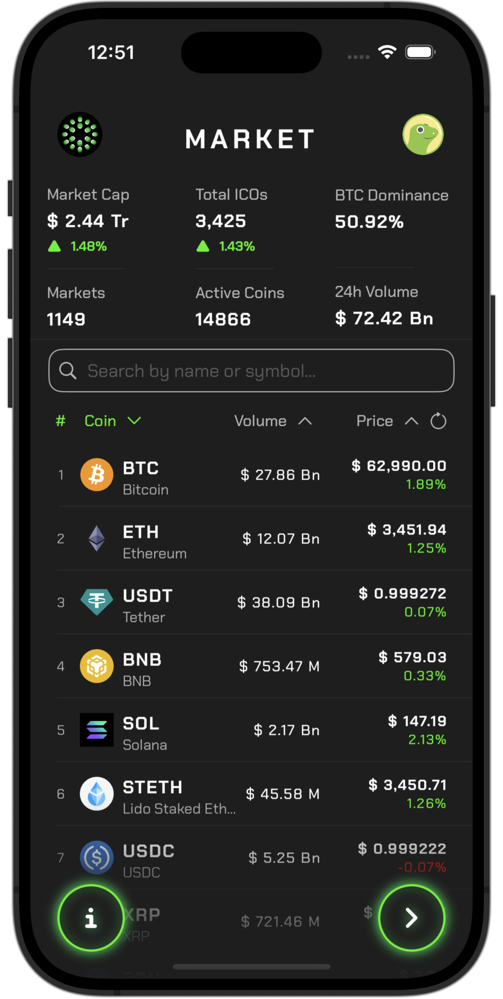
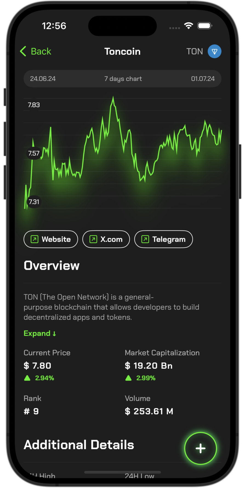
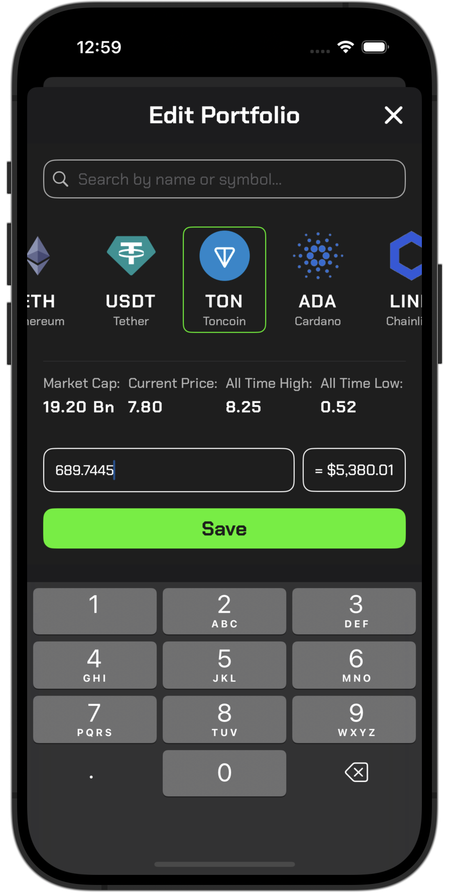
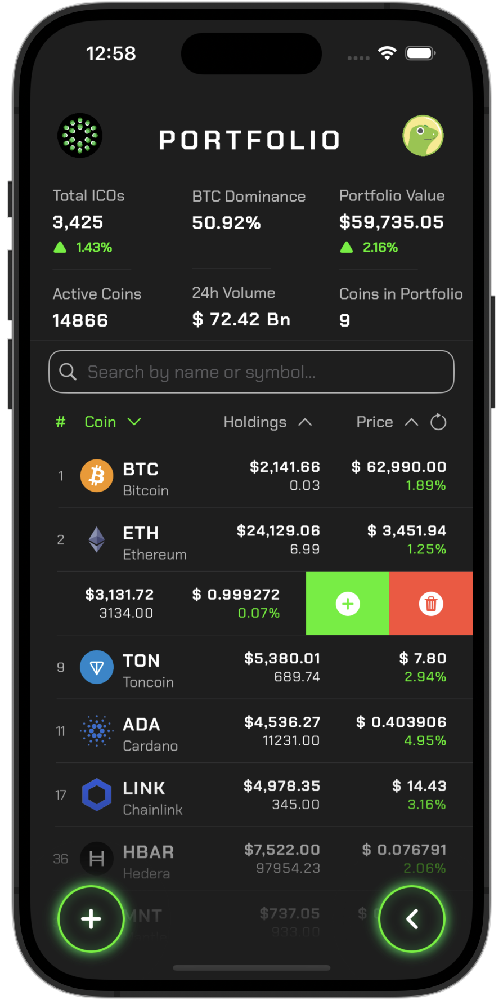
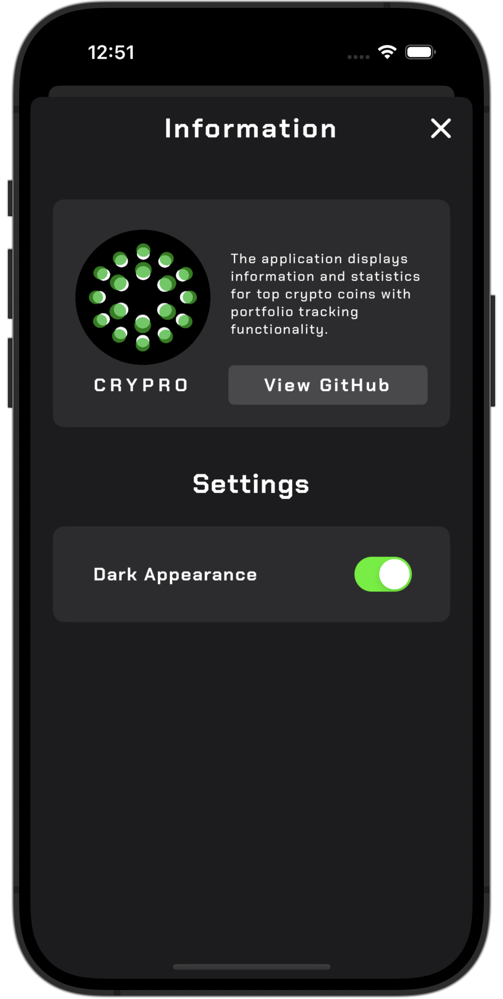
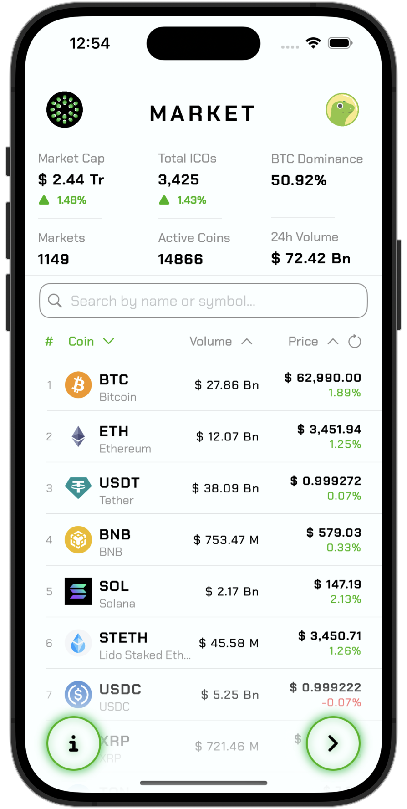
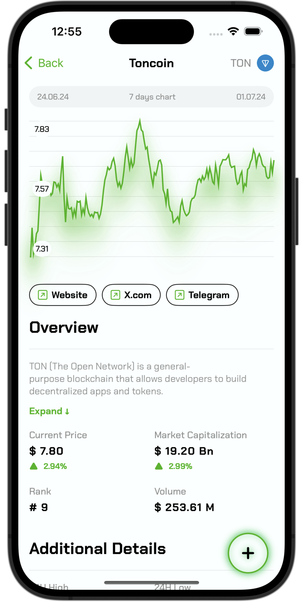
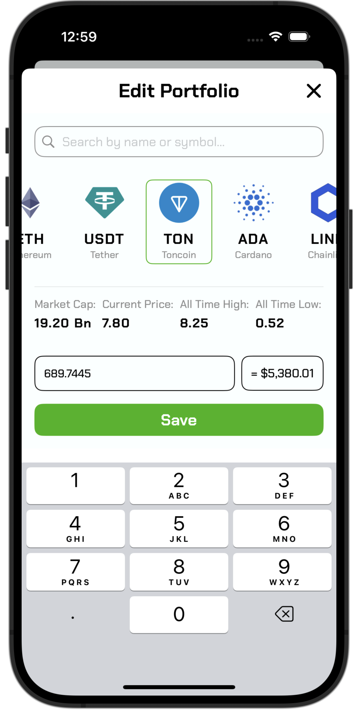
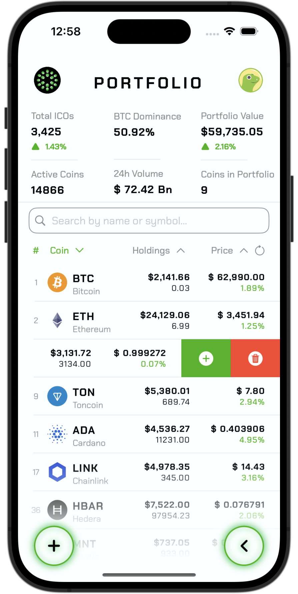
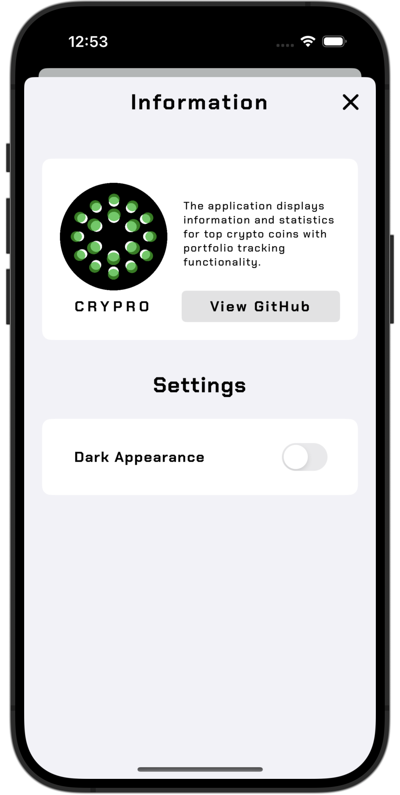

## Overview

Crypro is a comprehensive cryptocurrency tracking application designed for iOS users. 

It provides real-time data on top cryptocurrencies, including prices, market trends, and detailed coin information. 

The data is sourced from the [CoinGecko API](https://www.coingecko.com/en/api), ensuring accurate and up-to-date information.

Users can manage their portfolios, track investments, and analyze performance, all within a sleek and intuitive interface. 

The app supports both dark and light modes for a comfortable viewing experience.

## Features

* No 3rd-party libraries
* Image caching
* Error handling
* Dark & light mode support

## Stack

* SwiftUI
* Combine
* CoreData
* MVVM

##  Usage

* Market: View the top coins, latest prices and market trends.
* Portfolio: Add, edit and track your investments and see their performance.
* Details: Get detailed information about each cryptocurrency and quickly add it to your portfolio.

## Demo

### Interface demo
| Market | Portfolio | Details |
:---:|:---:|:---:
 |  | 

### Dark Mode 
| Market | Details | Transaction | Portfolio | Settings |
:---:|:---:|:---:|:---:|:---:
 |  |  |  | 

### Light Mode
| Market | Details | Transaction | Portfolio | Settings |
:---:|:---:|:---:|:---:|:---:
 |  |  |  | 

## Requirements
* iOS 16.0+

## Installation

1. [Download](https://github.com/Antomated/Crypro/archive/refs/heads/main.zip) repository
2. Open Crypro.xcodeproj using Xcode
3. Build & Run with <kbd>   command   </kbd> + <kbd>  R  </kbd>

## Contact
For questions, please contact [me](https://github.com/Antomated).

## License

This project is licensed under the MIT License - see the [LICENSE](LICENSE) file for details.
